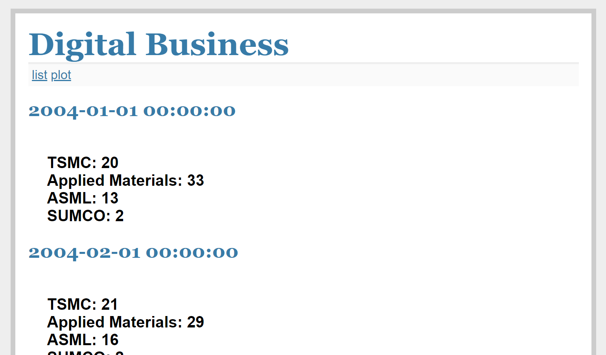
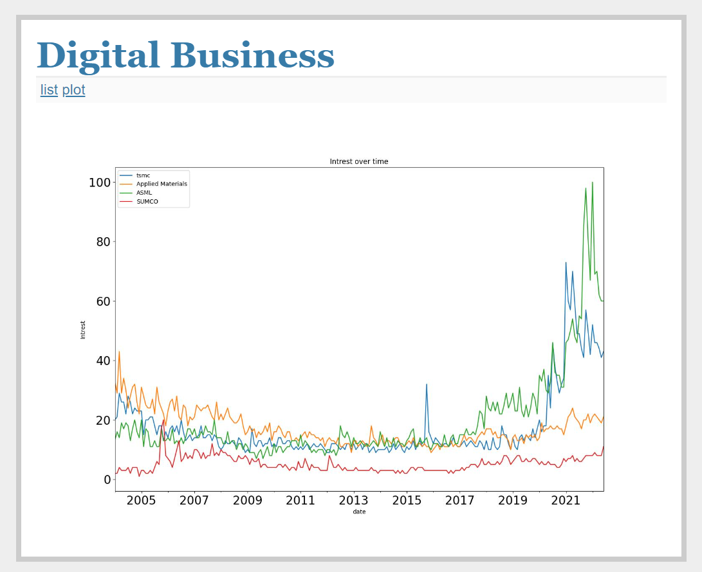
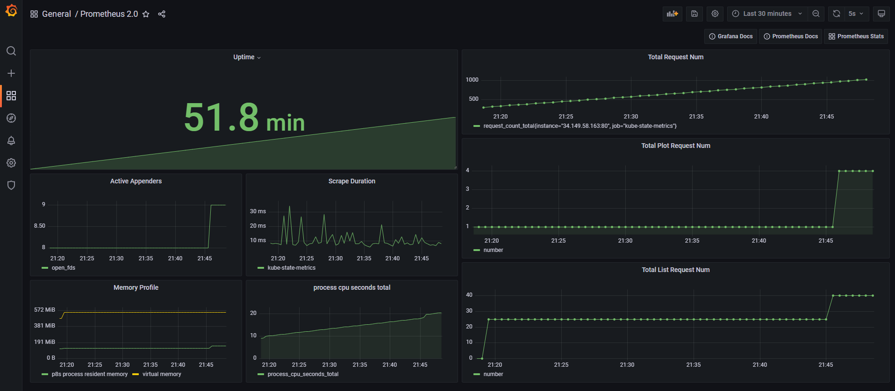
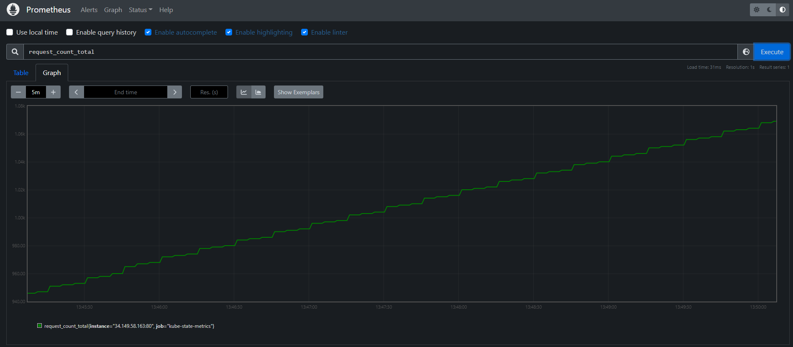

# Digital Business
This repository is modified from the original repository of [Flask-MVC](https://github.com/arthurtibame/Flask-MVC)

# Path introduction
1）最上層 web 目錄是項目名稱，一個項目內可以有多個模塊(這邊叫app)，也就是應用，每個應用下有自己的setting，初始化文件，MVC架構。 

2）runserver.py：與應用模塊平級，作為項目啟動文件

3）第二级app目錄：模塊名稱

       controller目錄：MVC中的C,主要存放視圖函數

       model目錄：MVC中的M,主要存存放實體文件, 映射db中table

       templates：MVC中的V，存放html文件

       static：靜態文件,存放html、css、js 等

       __init__.py:模塊初始化文件，Flask 程序對象的創建必須在 __init__.py 文件裡完成，然後我們就可以安全導入package

       setting.py:配置文件、database等等

# How to run
```sh
python -m pip install -r requirements.txt
python runserver.py
```
# How to test
```sh
python -m pytest runserver.py tests --doctest-modules --junitxml=test-results.xml --cov-config=.coveragerc --cov=. --cov-report=html
```
1) Coverage結果，會放在htmlcov 資料夾
2) 點擊程式的.html檔案，確認Coverage狀況
# How to create a new database (myweb.sqlite)
```python
# In app directory
from app import db
db.create_all()
```

# Digital Business Deploy on GKE
* http://34.149.58.163/

# Some screenshots
## index.html

## list.html

## plot.html

## Grafana

* http://104.199.218.228:3000/d/bXTb76rnk/prometheus-2-0?orgId=1
## Prometheus

* http://34.80.138.166:8086/
